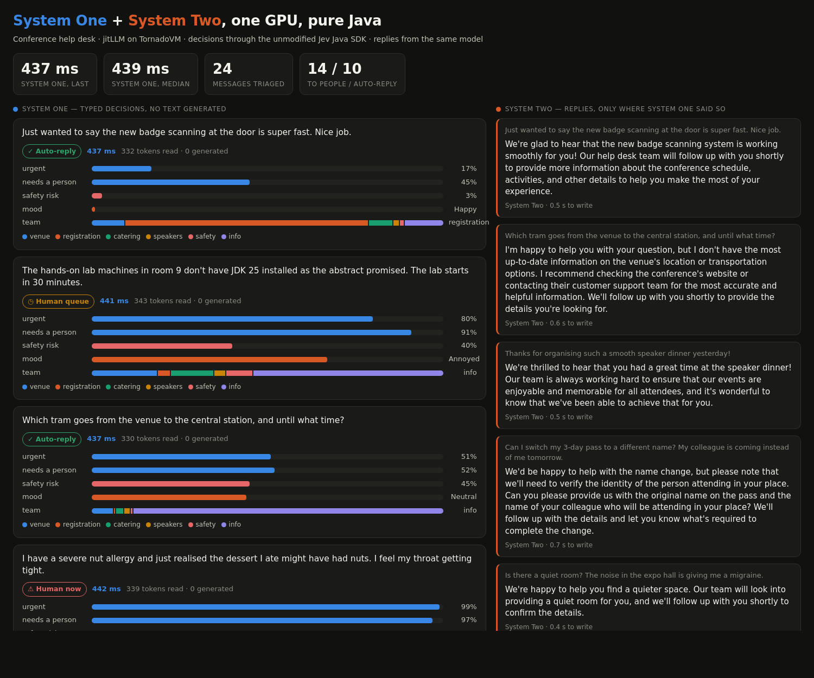

# System One + System Two, one GPU, pure Java

A live conference help desk built on **[jitLLM](https://github.com/beehive-lab/jitllm)** (LLM
inference in Java, GPU kernels JIT-compiled by **TornadoVM**) and the **Jev** "System One" API
contract.

- **System One** triages every incoming message in one call: *urgent?*, *which team?*, *how does the
  sender feel?*, *needs a person?*, *safety risk?*. It returns typed answers with probabilities and
  generates no text. The calls go through the unmodified community Jev Java SDK
  (`com.jamilxt:typesafe-ai-java-core`), pointed at `jitllm serve` instead of `api.typesafe.ai`.
- **System Two** is the same model on the same GPU, generating text. It drafts a reply only for the
  messages System One routes to auto-reply. Emergencies and angry customers go to people.



## What you'll see

Open the dashboard and 24 help-desk messages arrive one by one (a lost badge, a projector failing
before a talk, a nut allergy, a chained fire exit, a thank-you note...). For each message:

1. **Left: System One decides.** Probability bars fill in for *urgent*, *needs a person*, *safety
   risk*, *mood* and *team*, with the time it took (a few hundred ms) and "0 tokens generated". A
   badge shows the route: **⚠ Human now**, **◷ Human queue** or **✓ Auto-reply**.
2. **Right: System Two replies**, token by token, but only for messages routed to auto-reply.
   Emergencies and angry messages are never answered by the model; they go to people.
3. **Top:** System One latency (last and median), and how many messages went to people vs. were
   auto-answered.

`bench` mode prints the same triage done two ways on the same model (scoring vs. asking the model for
JSON), with latency, JSON validity and agreement.

## Run it

You need an NVIDIA GPU with CUDA, JDK 21, Maven, git, and Python 3 (used by TornadoVM's build).

**1. Build jitLLM with the `/v1/systemone` endpoint** (beehive-lab/jitllm#190). jitLLM's helper script
builds the TornadoVM SDK it needs; the first run takes a while.

```bash
git clone -b feat/systemone-decisions https://github.com/beehive-lab/jitllm.git && cd jitllm
scripts/tornadovm-dev.sh setup --backend cuda --jdk 21
scripts/tornadovm-dev.sh build clean package -DskipTests
```

**2. Download a model and start the server** (in the `jitllm` directory, keep it running):

```bash
curl -L -o Llama-3.2-3B-Instruct-Q8_0.gguf \
  https://huggingface.co/bartowski/Llama-3.2-3B-Instruct-GGUF/resolve/main/Llama-3.2-3B-Instruct-Q8_0.gguf
eval "$(scripts/tornadovm-dev.sh env)"
./jitllm serve --gpu --model Llama-3.2-3B-Instruct-Q8_0.gguf --ctx-size 4096 \
    --with-prefill-decode --batch-prefill-size 128 --port 8080
```

Ready when it prints `listening on http://127.0.0.1:8080`. For a faster, smaller model use
`Llama-3.2-1B-Instruct-f16.gguf` from `bartowski/Llama-3.2-1B-Instruct-GGUF` (routing is less reliable).

**3. Run the demo** (in this repository, another terminal):

```bash
mvn -q package
java -jar target/jev-demo.jar dashboard       # then open http://127.0.0.1:9090
java -jar target/jev-demo.jar bench           # scoring vs. generating JSON, prints a table
```

Options: `--jitllm URL` (default `http://127.0.0.1:8080`), `--port N` for the dashboard (default
9090), `--pause MS` between messages (default 1200).

The whole System One side is this (`Triage.java`):

```java
TypeSafeClient client = TypeSafeClient.builder("local").baseUrl("http://127.0.0.1:8080").build();
SystemOneResult r = client.evaluate(EvaluationRequest.of(message)
        .noul("urgent", "Does this need action within the next 15 minutes?")
        .choice("team", "Which team should handle this message?", TEAMS)
        .score("mood", "How does the sender feel?", List.of("Happy", "Neutral", "Annoyed", "Angry"))
        .noul("needs_human", "Does this need a person on site, rather than an automated written reply?")
        .noul("safety_risk", "Is anyone's health or safety at risk?", "someone could get hurt", "no risk")
        .build());
```

## What it measured (RTX 4090, CUDA)

System One latency for one message and four questions, warm, median of 5:

| model | latency |
|---|---:|
| Qwen3-0.6B F16 | 80 ms |
| Llama-3.2-1B F16 | 100 ms |
| Llama-3.2-3B Q8_0 | 347 ms |

The same triage (5 typed fields, 24 messages) done two ways on the same model: scoring
(`/v1/systemone`) vs. asking it for JSON (`/v1/chat/completions`). Full tables are in
[`docs/results/`](docs/results/).

| model | scoring | JSON generation | what the JSON path got wrong |
|---|---:|---:|---|
| Llama-3.2-1B F16 | **121 ms** (p90 122) | 227 ms (p90 248) | 2/24 invalid JSON; `team` outside the allowed set ("AV", "room 1", null, ...) |
| Llama-3.2-3B Q8_0 | 432 ms | 411 ms | none invalid; sent the nut-allergy emergency to "info" |

What that says, plainly:

- **Typed answers can't be off-schema.** Scoring only ever picks one of the options it was given,
  with a probability for each. The JSON path produced invalid JSON or values outside the schema on
  the 1B model.
- **On safety, scoring did better on both models.** With 3B, `safety_risk` is 0.98-1.00 on all five
  real safety cases (fainting, being followed, chained fire exit, leak over power strips, nut
  allergy), and all five go to "human now". There is one false positive: a speaker's broken
  projector scores 0.72, which the policy also sends to a person. Everything else is 0.54 or lower.
- **Speed is a draw at 3B today, not 8x.** Each question costs one batched-prefill chunk in jitLLM
  (~85 ms at 3B, whatever its length), so five questions cost five chunks. Scoring every question in
  one prefill pass is the jitLLM change that would turn this into the multi-x win vLLM-based
  implementations report. See the PR's "follow-ups".
- **The probabilities are not calibrated.** A prompted chat model leans "yes", which is why the
  routing thresholds in `Triage.route()` are explicit policy, set once for the model. A trained
  System One head (e.g. Kev) is what makes 0.5 mean 0.5.

## Pieces

| | |
|---|---|
| `src/main/java/dev/jitllm/jev/Triage.java` | System One: the Jev SDK call and the routing policy |
| `src/main/java/dev/jitllm/jev/Dashboard.java`, `src/main/resources/web/index.html` | the live page, server-sent events |
| `src/main/java/dev/jitllm/jev/Bench.java` | scoring vs. generating JSON |
| `src/main/resources/messages.json` | 24 help-desk messages |
| [`docs/DESIGN.md`](docs/DESIGN.md) | what Jev is, how it maps onto jitLLM, the phases |
